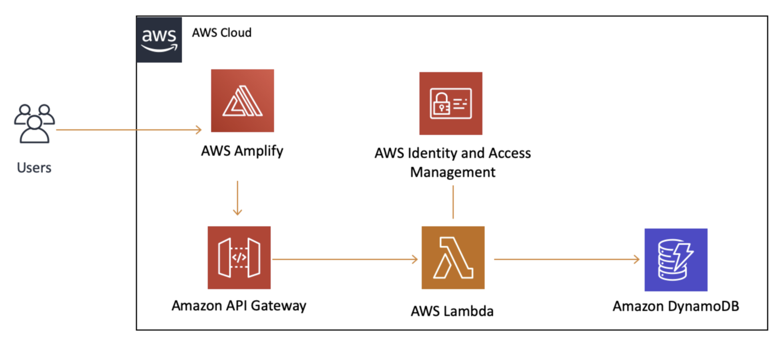

# AWS Fullstack Developer Tutorial

## Basic Web Application

- Webアプリケーションの作成

- Webアプリケーションをサーバレスバックエンドに接続

- APIとDBを使用してWebアプリケーションに対話性を追加

## Application Architecture

## reference

[AWS で基本的なウェブアプリケーションを構築する](https://aws.amazon.com/jp/getting-started/hands-on/build-web-app-s3-lambda-api-gateway-dynamodb/?e=gs2020&p=fullstack)