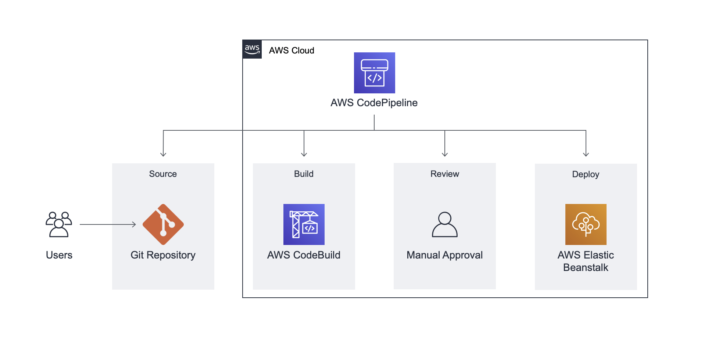

# AWS DevOps Engineer Tutorial

## Build CI/CD Pipeline

- Set up GitHub repo for app code

- Build AWS Elastic Beanstalk env and deploy app

- Set up AWS CodeBuild to build source code from GitHub

- Use AWS CodePipeline to set up a CD pipeline at the source, build, and deploy stages

## Application Architecure

## reference

[AWS で継続的デリバリーパイプラインを作成する](https://aws.amazon.com/jp/getting-started/hands-on/create-continuous-delivery-pipeline/?e=gs2020&p=devops)